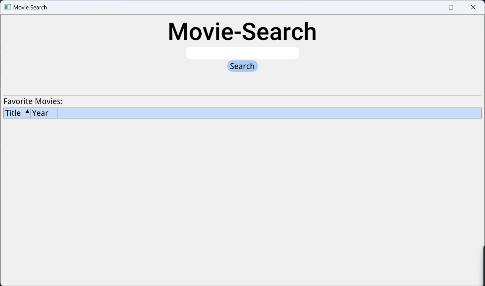

# Movie Finder App

A desktop application written in **C++** for searching and managing movies using the OMDb API.

## Features

- **Search Movies by Title**  
  Query any movie name and view detailed results inside the app.

- **View Movie Information**  
  Each result includes the title, release year, rating, poster, and more.

- **Manage Favorites**  
  Save movies to a personal favorites list.

- **Persistent Storage**  
  Favorite movies are saved in a local file (`favorites.txt`) and are automatically loaded when the application starts.

- **Responsive UI with Threads**  
  Search operations run in background threads to keep the UI responsive while interacting with the application.

## Technologies Used

- C++17
- OMDb API
- Dear ImGui (GUI rendering)
- nlohmann/json (JSON parsing)
- cpr (HTTP requests)
- std::thread (multithreading)

## CPP File Structure

| File Name         | Description                                                  |
|-------------------|--------------------------------------------------------------|
| `main.cpp`        | Entry point of the application and main loop                 |
| `GuiManager.cpp`  | Handles GUI rendering and user interactions                  |
| `OMDBApi.cpp`     | Sends requests to the OMDb API and parses the responses      |
| `ImageLoader.cpp` | Loads and manages poster images from URLs                    |

## Build Instructions

### Prerequisites

Make sure you have the following installed:

- A C++17-compatible compiler
- CMake
- The following libraries:
  - [Dear ImGui](https://github.com/ocornut/imgui)
  - [nlohmann/json](https://github.com/nlohmann/json)
  - [cpr](https://github.com/libcpr/cpr)

### Build Steps


```bash
git clone https://github.com/your-username/movie-finder-app.git
cd movie-finder-app
mkdir build
cd build
cmake ..
make
```

In addition, it's possible to open the app folder with CLion, then run the main.cpp file.

## Favorites Storage
The application saves the list of favorite movies to a local file named favorites.txt.
This file is read on startup to restore the previously saved favorites.

## In-app screenshot
Here is a preview of the app interface:

